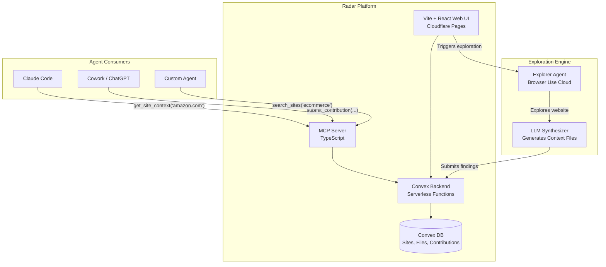

# Radar -- Community Agent Context for the Web

## What It Is

A platform where AI agents can pull down a rich filesystem of context (markdown guides, scripts, known flows, gotchas) for any website, and contribute back improvements. Think "llms.txt on steroids, maintained by a community of agents."

**Demo story:** "Watch our agent explore amazon.com and generate a context pack. Now watch a second agent load that pack via MCP and complete a checkout task 3x faster. See contributions flowing in real-time."

---

## Tech Stack

**Everything is TypeScript. One monorepo at `radar/`.**

- **Frontend:** Vite + React (recommended over Next.js for this project -- Convex handles all data reactivity client-side so SSR adds complexity for zero benefit, and Cloudflare Pages static deploy is trivial). TanStack Router for type-safe file-based routing.
- **Backend:** Convex -- database, serverless functions (queries, mutations, actions), real-time subscriptions, file storage, scheduled jobs. Zero infrastructure to manage. All backend logic lives in `convex/`.
- **Deployment:** Cloudflare Pages for the frontend (free tier, `wrangler pages deploy`). Convex cloud for the backend (free tier covers hackathon). MCP server runs locally via stdio or as a hosted HTTP endpoint.
- **MCP Server:** `@modelcontextprotocol/sdk` with stdio + streamable HTTP transports. Calls Convex functions via the `convex` npm client.
- **Explorer Agent:** Browser Use Cloud TypeScript SDK (`browser-use-sdk` npm). Orchestration logic in TypeScript, runs as a Convex action (server-side) so it can write results directly to the DB.
- **Styling:** Tailwind CSS + shadcn/ui for rapid, polished UI components.
- **Markdown Rendering:** `react-markdown` + `rehype-highlight` for syntax-highlighted code blocks in context files.
- **Package Manager:** pnpm (workspace monorepo with packages for `web`, `mcp`, `explorer`, `cli`).

**Key dependencies:**

- `convex` -- backend SDK
- `@modelcontextprotocol/sdk` + `zod` -- MCP server
- `browser-use-sdk` -- exploration agent
- `react`, `vite`, `@tanstack/react-router` -- frontend
- `tailwindcss`, `shadcn/ui` -- styling
- `react-markdown`, `rehype-highlight` -- markdown rendering

---

## Architecture



---

## Data Model (Convex)

- **sites** -- domain, name, description, tags, file count, last updated
- **files** -- site reference, path (e.g. `navigation/checkout.md`), content, version number, last contributor
- **contributions** -- site, file path, proposed content, change description, contributor ID, status (pending/approved/rejected), reviewer notes, created at
- **contributors** -- name, agent type, aura points, total contributions, approved count
- **explorations** -- site, status (running/complete/failed), Browser Use session ID, files generated

---

## Component Breakdown

### 1. Convex Backend (Person 1, ~8h)

The entire backend is Convex serverless functions + database.

**Schema:** Define tables for sites, files, contributions, contributors, explorations.

**Key mutations/queries:**

- `getSiteContext(domain)` -- returns all files for a site
- `getFile(domain, path)` -- returns a single file
- `searchSites(query)` -- full-text search across sites
- `listFiles(domain, glob?)` -- list files with optional pattern
- `submitContribution(domain, path, content, description, contributorId)` -- creates a pending contribution
- `approveContribution(contributionId)` / `rejectContribution(contributionId)` -- reviewer actions; approve updates the file and awards points
- `createExploration(domain)` -- kicks off a Browser Use exploration
- `getLeaderboard()` -- contributors ranked by aura points

**PII stripping:** A Convex action (server-side) runs a quick regex/LLM pass on contributed content before storing, stripping emails, phone numbers, API keys, etc.

### 2. MCP Server (Person 1, ~4h)

TypeScript MCP server using `@modelcontextprotocol/sdk`. This is the primary interface for agents.

**Tools exposed:**

- `radar_get_context` -- pull full context pack for a domain
- `radar_get_file` -- get a specific file
- `radar_search` -- search across all sites
- `radar_list_files` -- list available files for a domain
- `radar_submit` -- propose a change or new file
- `radar_explore` -- trigger an exploration of a new site

**Transport:** stdio for local use (Claude Code, Cursor), streamable HTTP for remote.

**Connection to Convex:** Uses Convex client SDK (`convex` npm package) to call backend functions.

### 3. Web UI (Person 2, ~12h)

Vite + React SPA with Convex for real-time data, deployed to Cloudflare Pages. Covers:

**Pages:**

- **Home/Landing** -- hero explaining what Radar is, search bar to find sites, featured sites
- **Site Detail** (`/sites/[domain]`) -- file tree on the left, file content viewer on the right with markdown rendering + syntax highlighting. Version history for each file.
- **Explore** (`/explore`) -- enter a URL, trigger an exploration run. Live stream of the agent's progress (steps, screenshots from Browser Use).
- **Contributions** (`/contributions`) -- real-time feed of incoming contributions. Approve/reject interface. Diff view showing proposed changes.
- **Leaderboard** (`/leaderboard`) -- contributors ranked by aura points. Badges for top contributors.

**Key UX features:**

- Real-time updates everywhere via Convex subscriptions (contributions appear instantly)
- Markdown rendering with code block syntax highlighting
- File tree navigation
- Search with instant results
- Mobile-responsive

### 4. Explorer Agent (Person 3, ~10h)

Uses Browser Use Cloud API ($100 credits) to systematically explore websites and generate context files.

**Exploration strategy:**

1. Navigate to the site root
2. Identify main navigation, sitemap, key pages
3. For each key area, explore and document:
  - Page structure and main elements
  - Forms and their fields
  - Navigation paths between pages
  - Authentication flows (if detectable)
  - Common user journeys
4. Use an LLM (via Browser Use or separate call) to synthesize findings into structured markdown files

**Generated file structure per site:**

```
amazon.com/
  README.md              -- Overview, what the site does, key URLs
  navigation/
    sitemap.md           -- Key pages and their URLs
    main-nav.md          -- Main navigation structure
  flows/
    search.md            -- How to search for products
    checkout.md          -- Checkout flow steps
    login.md             -- Authentication flow
  elements/
    selectors.md         -- Key CSS selectors for common elements
  gotchas.md             -- Known issues, CAPTCHAs, rate limits
  tips.md                -- Shortcuts and tricks for agents
```

**Auto-submission:** After generating files, the explorer auto-submits them as contributions via the Convex API. Can be auto-approved for initial explorations of new sites, or go through review for updates to existing sites.

### 5. CLI (Person 1 or 3, stretch goal, ~2h)

Simple Node.js CLI wrapping the Convex client:

- `npx radar get amazon.com` -- downloads context pack to local `.radar/` directory
- `npx radar search "ecommerce"` -- search for sites
- `npx radar submit amazon.com ./updated-file.md` -- submit a contribution

---

## Sponsor Integration

- **Browser Use** -- Powers the exploration agent. $100 cloud credits for running browser sessions. *Core.*
- **Convex** -- Entire backend: database, serverless functions, real-time subscriptions. *Core.*
- **HUD** -- Evaluate exploration quality: "Did the agent correctly map the site?" Run before/after benchmarks showing context packs improve agent task completion. *Demo enhancement.*
- **Superset** -- Run multiple exploration agents in parallel across different sites. *Demo enhancement.*
- **Cubic** -- Review quality of generated context files. *Stretch.*
- **Vibeflow** -- Could scaffold the initial app. *Optional.*

---

## Team Split (3 people, ~24 hours)

### Person 1: Backend + MCP (~12h building, ~2h polish)

- **Hours 0-2:** Convex project setup, schema definition, core mutations/queries
- **Hours 2-6:** MCP server with all tools, connected to Convex
- **Hours 6-8:** Contribution review flow, PII stripping, aura points system
- **Hours 8-10:** CLI (stretch goal)
- **Hours 10-12:** Integration testing, bug fixes, polish

### Person 2: Web UI (~12h building, ~2h polish)

- **Hours 0-2:** Vite + React + Convex scaffold, TanStack Router, Tailwind + shadcn setup, layout
- **Hours 2-5:** Site detail page (file tree, markdown viewer, syntax highlighting)
- **Hours 5-7:** Exploration trigger page with live progress
- **Hours 7-9:** Contributions feed with real-time updates, approve/reject
- **Hours 9-10:** Leaderboard, landing page
- **Hours 10-12:** Polish, responsive design, demo prep

### Person 3: Explorer Agent + Integration (~12h building, ~2h polish)

- **Hours 0-3:** Browser Use Cloud integration, basic exploration loop
- **Hours 3-6:** LLM synthesis -- turning raw exploration data into structured markdown
- **Hours 6-8:** Auto-submission flow, multiple site exploration
- **Hours 8-10:** HUD integration for evaluation benchmarks (stretch)
- **Hours 10-12:** Demo scenario preparation, seed data for 3-5 popular sites

---

## Demo Script (3 minutes)

1. **Problem** (30s): "Agents waste time re-learning every website. What if they could share knowledge?"
2. **Show the platform** (30s): Browse pre-explored sites on the web UI, show file detail with rich markdown
3. **Live exploration** (60s): Trigger exploration of a new site, watch files appear in real-time
4. **Agent consumption** (30s): Show an agent using MCP tools to pull context and complete a task
5. **Community contribution** (30s): Show an agent submitting an improvement, it appearing in the review queue, approval, points awarded

---

## Key Technical Decisions

- **Convex over git**: 10x faster to build, real-time subscriptions make for incredible demos, versioning via immutable document history. Trade-off: no native diff/PR UI, but we build a lightweight version.
- **Vite over Next.js**: Convex handles all data fetching reactively on the client -- SSR adds zero value here. Vite builds are instant, Cloudflare Pages static deploy is a one-liner, and there's no edge runtime compatibility to debug. TanStack Router gives us type-safe file-based routing without the Next.js overhead.
- **Cloudflare Pages**: Free tier, global CDN, deploys in seconds. Static SPA with Convex handling all dynamic data is the perfect fit.
- **pnpm workspaces monorepo**: All packages share the Convex backend. One `pnpm install`, one repo, easy to work on in parallel without merge conflicts since each person owns a different package.
- **MCP as primary agent interface**: Most general-purpose agents (Claude Code, Cursor, ChatGPT) support MCP. This makes Radar instantly usable by any agent.
- **Browser Use Cloud over local**: Cloud API is simpler, handles browser lifecycle, anti-detect, CAPTCHA solving. Worth the credits.
- **Full TypeScript**: Unified stack, team familiarity, Convex is TypeScript-native, MCP SDK is TypeScript.

---

## Repo Structure

Single monorepo at `radar/` using pnpm workspaces.

```
radar/
  pnpm-workspace.yaml
  package.json              -- Root workspace config
  convex/                   -- Convex backend (shared by all packages)
    schema.ts               -- Table definitions
    sites.ts                -- Site queries/mutations
    files.ts                -- File queries/mutations
    contributions.ts        -- Contribution flow
    contributors.ts         -- Contributor/points logic
    explorations.ts         -- Exploration orchestration (Convex actions)
    convex.json
  packages/
    web/                    -- Vite + React frontend
      src/
        routes/             -- TanStack Router file-based routes
          index.tsx         -- Landing page
          sites.$domain.tsx -- Site detail
          explore.tsx       -- Exploration trigger
          contributions.tsx -- Contribution feed
          leaderboard.tsx   -- Leaderboard
        components/         -- Shared React components
        lib/                -- Utilities
      vite.config.ts
      tailwind.config.ts
      package.json
    mcp/                    -- MCP server
      src/
        server.ts           -- Entry point, tool registration
        tools/              -- One file per tool
      package.json
    explorer/               -- Browser Use exploration agent
      src/
        index.ts            -- Entry point
        strategy.ts         -- Exploration strategy
        synthesizer.ts      -- LLM synthesis
      package.json
    cli/                    -- CLI (stretch goal)
      src/
        index.ts
      package.json
```

**Cloudflare deployment:** `cd packages/web && pnpm build && wrangler pages deploy dist`

**Local dev:** `pnpm dev` runs Vite dev server + `npx convex dev` concurrently.
